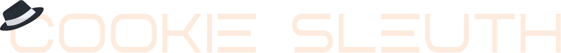

  

# Threat Detection Specifications & Guide

This document details the threat detection rules, scoring mechanisms, and risk algorithms used by **Cookie Sleuth** to identify cookie stuffing, unauthorized affiliate attribution, and covert tracking drops.

---

## 1. Tab-Scoped User Intent

### Anchor ID: `#1-tab-scoped-user-intent`

### What It Means

When a user clicks an outbound affiliate link, Cookie Sleuth registers a short-lived **User Intent Event** tied explicitly to the `tabId` of the current browser tab.

### How Detection Works

When a domain attempts to set an attribution cookie, Cookie Sleuth checks if a valid user click was registered for that exact domain within the last **4,000 ms** _on that specific tab_.

### Risk Weight & Reason Tags

- **No Matching Intent Detected:** `+5 Score Penalty`
- **Triggered Reason:** `No matching user intent on this tab`
- **Legitimate Intent Verified:** `-10 Score Discount` (or `-2` if dropped mid-redirect)

---

## 2. Richer User Intent Tracking

### Anchor ID: `#2-richer-user-intent`

### What It Means

Cookie Sleuth does not rely on generic page clicks. It records rich interaction metadata before allowing an attribution cookie to be set.

### Metadata Captured

- **Source URL:** The page origin where the click occurred.
- **Target Domain:** The destination domain extracted from the anchor tag.
- **Tab Context:** The isolated browser tab ID.
- **Interaction Type:** Verified DOM event type (`pointerdown` / `click`).

---

## 3. Affiliate Cookie Confidence Scoring

### Anchor ID: `#3-affiliate-cookie-confidence-scoring`

### What It Means

Cookie Sleuth analyzes cookie key names against a fingerprint index of standard affiliate parameters, weighting each marker based on its likelihood of being used strictly for monetary attribution rather than standard functionality.

### Weighted Fingerprint Index

| Marker Pattern        | Base Weight    | Classification Label        |
| :-------------------- | :------------- | :-------------------------- |
| `/aff_id\|affid/i`    | **+10 Points** | `Affiliate ID parameter`    |
| `/clickid\|cj_data/i` | **+9 Points**  | `Click tracking identifier` |
| `/partner/i`          | **+7 Points**  | `Partner tracking marker`   |
| `/tag/i`              | **+5 Points**  | `Generic tag parameter`     |
| `/ref/i`              | **+3 Points**  | `Referral marker`           |

---

## 4. First-Party vs. Third-Party Detection

### Anchor ID: `#4-first-party-vs-third-party-detection`

### What It Means

Evaluates whether an attribution cookie is being set by the website currently visible in the active address bar (**First-Party**) or by an unrequested background domain (**Third-Party / Cross-Site**).

### How Detection Works

Cookie Sleuth extracts the active tab hostname or the `details.initiator` origin and compares it against the target cookie domain.

### Risk Weight & Reason Tags

- **Third-Party Domain Context:** `+5 Score Penalty`
- **Triggered Reason:** `Third-party domain attribution`
- **First-Party Context:** `0 Score Adjustment`

---

## 5. Track How the Cookie Was Delivered

### Anchor ID: `#5-track-how-the-cookie-was-delivered`

### What It Means

Identifies the technical vector used to drop the cookie. Covert cookie stuffing frequently relies on invisible subframes or automated background scripts rather than top-level page navigations.

### Delivery Vectors & Weights

- **Background Iframe (`sub_frame`):** **+5 Score Penalty** — `Set via background iframe`
- **Client Script (`script` / `document.cookie`):** **+3 Score Penalty** — `Set via client script`
- **Asynchronous API (`xmlhttprequest` / `fetch`):** **+3 Score Penalty** — `Set via client xmlhttprequest`
- **Top-Level Navigation (`main_frame`):** **0 Score Adjustment**

---

## 6. Navigation and Request Correlation

### Anchor ID: `#6-navigation-and-request-correlation`

### What It Means

Monitors intermediate HTTP response headers during page navigations to catch cookies dropped "mid-flight" during HTTP 300-series redirect chains.

### How Detection Works

Cookie Sleuth inspects `details.statusCode` in `webRequest.onHeadersReceived` for HTTP redirect statuses (`301`, `302`, `303`, `307`, `308`).

### Risk Weight & Reason Tags

- **Cookie Set Mid-Flight:** `+5 Score Penalty`
- **Triggered Reason:** `Cookie set during HTTP [Code] redirect hop`
- **Intent Adjustment:** Reduces the standard intent discount from `-10` to `-2` to prevent single link clicks from authorizing multi-hop cookie drops.

---

## 7. Negative Evidence Evaluation

### Anchor ID: `#7-negative-evidence`

### What It Means

Combines the absence of positive signals (e.g., missing user click) with the presence of high-risk indicators (e.g., background iframe drop on a third-party domain).

### High-Risk Combinations

- `No User Intent` + `Third-Party Domain` + `Subframe Delivery` = **Critical Threat State (>85% Probability)**

---

## 8. Affiliate Network Intelligence

### Anchor ID: `#8-affiliate-network-intelligence`

### What It Means

Maintains a local intelligence index of known commercial affiliate networks and URL tracking parameter patterns.

### Known Network Fingerprints (+10 Weight)

- **Commission Junction (CJ):** `anrdoezrs.net`, `cj.com`
- **Impact:** `impact.com`, `impactradius`
- **ShareASale:** `shareasale.com`
- **Awin:** `awin1.com`, `awin`
- **FlexOffers:** `flexoffers.com`
- **Rakuten:** `linksynergy.com`, `rakuten`
- **Skimlinks / VigLink:** `skimlinks.com`, `viglink.com`
- **ClickBank:** `clickbank.net`

### Tracking URL Query Parameters (+8 Weight)

Matches incoming URLs containing `?aff_id=`, `?clickid=`, `?ref=`, `?partner=`, `?tag=`, `?cj_data=`, or `?subid=`.

---

## 9. Threat/Risk Scoring Engine

### Anchor ID: `#9-threatrisk-scoring`

### Confidence Threshold

A cookie event is flagged as an unsolicited threat when its cumulative calculated score meets or exceeds the **Confidence Threshold of 5 Points**.

### Probability Formula

$$\text{Threat Probability (\%)} = \min\left(\left\lfloor \frac{\text{Score}}{25} \times 100 \right\rfloor, 100\right)$$

---

## 10. Explainable Detection Model

### Anchor ID: `#10-explainable-threat-score`

Every threat logged by Cookie Sleuth contains an immutable array of human-readable reasons explaining exactly why the score was assigned.

### Popup Display Structure

Each logged threat card provides:

1. **Threat Probability Gauge:** Visual percentage representation.
2. **Context Badge:** `FIRST-PARTY` or `THIRD-PARTY` indicator.
3. **Itemized Evidence Breakdown:** Direct bullet points detailing the detected anomaly.
4. **Specification Deep Link:** Direct link to the corresponding section of this document.
